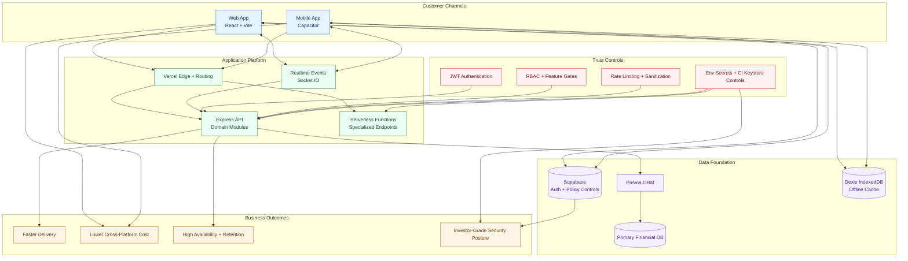
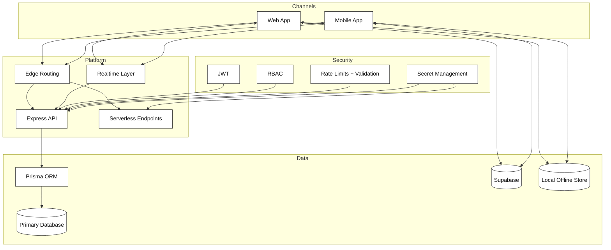

# Expense Tracker Architecture Briefing
*Stakeholder-Ready Technical Overview*

**Version:** 1.0  
**Date:** March 2026  
**Audience:** Product Owners, Developers, Security Teams, Investors

---

## Executive Summary

The Expense Tracker is a hybrid finance platform delivering a unified experience across web and mobile through a single React codebase. The architecture employs a modular backend API, offline-first data strategy, and multi-layered security controls suitable for financial applications.

**Key Architecture Decisions:**
- Single React application deployed to web browsers and mobile via Capacitor
- Node.js/Express backend with Prisma ORM for primary data persistence
- Supabase integration for authentication and real-time capabilities
- Offline-first design with Dexie.js local storage
- Role-based access control with JWT authentication

---

## Technology Stack

### Frontend (Web & Mobile)
- **Framework:** React 18 + TypeScript
- **Build System:** Vite with optimized production builds
- **Styling:** Tailwind CSS with component libraries
- **State Management:** Context API with custom hooks
- **Offline Storage:** Dexie.js (IndexedDB wrapper)
- **Real-time:** Socket.IO client
- **Mobile Runtime:** Capacitor with native plugins
- **Auth Client:** Supabase JavaScript SDK

### Backend API
- **Runtime:** Node.js with Express framework
- **Database:** Prisma ORM with PostgreSQL
- **Authentication:** JWT with bcrypt password hashing
- **Real-time:** Socket.IO server
- **Security:** Helmet, CORS, custom rate limiting
- **Validation:** Custom middleware with sanitization

### Infrastructure & Deployment
- **Web Hosting:** Vercel with custom routing
- **Mobile Build:** GitHub Actions with Android AAB generation
- **Containerization:** Docker for local development
- **CI/CD:** GitHub Actions for automated builds and deployments

---

## System Architecture

### 3-Tier Architecture Overview

```

                    Presentation Layer                       

  Web Browser (React)    Mobile App (Capacitor WebView)     

                    Application Layer                        

  Node.js/Express API    Vercel Serverless Functions        

                     Data Layer                              

  PostgreSQL (Prisma)    Supabase    Local IndexedDB       

```

### Data Flow Architecture

1. **Client Initialization**
   - App loads from Vite dev server or static hosting
   - Capacitor wraps web app for mobile deployment
   - Context providers initialize with configuration

2. **Authentication Flow**
   - Supabase handles OAuth and email/password auth
   - JWT tokens issued for API access
   - Role-based permissions derived from user metadata

3. **Data Synchronization**
   - Primary sync: Backend API with PostgreSQL
   - Real-time updates: Socket.IO connections
   - Offline capability: Local Dexie.js storage
   - Fallback: Supabase for additional auth/data paths

4. **API Request Lifecycle**
   - Request  CORS/Helmet  Auth  RBAC  Validation  Controller  Response

---

## API Surface Documentation

### Base Configuration
- **Main API Base:** `/api/v1`
- **Serverless Base:** `/api` (Vercel functions)
- **Versioning:** Path-based versioning for future compatibility

### Public Endpoints (No Authentication Required)

| Endpoint | Method | Purpose | Security Notes |
|----------|--------|---------|----------------|
| `/health` | GET | System health check | No auth required |
| `/auth/register` | POST | User registration | Rate limited, input validation |
| `/auth/login` | POST | User authentication | Rate limited, secure password handling |
| `/advisors` | GET | List available advisors | Public directory |
| `/advisors/:id` | GET | Advisor details | Public information |
| `/stocks/markets` | GET | Market data | External API proxy |
| `/stocks/search` | GET | Stock symbol search | External API proxy |
| `/stocks/stock` | GET | Individual stock data | External API proxy |
| `/stocks/batch` | POST | Batch stock queries | External API proxy |
| `/payments/webhook` | POST | Payment processor callbacks | Signature verification |

### Authenticated Endpoints (JWT Required)

#### Core Financial Management
- **Accounts:** CRUD operations for bank accounts, wallets, and payment methods
- **Transactions:** Complete transaction lifecycle with categorization
- **Goals:** Financial goal tracking and progress monitoring
- **Loans:** Loan management with payment tracking
- **Settings:** User preferences and application configuration
- **Friends:** Social features for expense sharing

#### Sync and Device Management
- **Sync Operations:** Bidirectional data synchronization
- **Device Registration:** Multi-device support with security controls
- **Device Management:** Device listing and deactivation

#### Security and PIN Management
- **PIN Operations:** Creation, verification, and updates
- **Security Status:** PIN expiration and security state queries
- **Admin PIN Reset:** Administrative PIN management

#### Advisory and Session Management
- **Booking System:** Advisor appointment scheduling
- **Session Management:** Real-time advisory sessions
- **Payment Processing:** Integrated payment flows
- **Notifications:** Push and in-app notifications

#### Administrative Functions
- **User Management:** Admin user operations
- **Advisor Approval:** Pending advisor review workflow
- **System Statistics:** Operational metrics and reporting
- **Feature Flags:** Dynamic feature management

---

## Security Architecture

### Authentication & Authorization

#### JWT-Based Authentication
- **Token Structure:** User ID, role, approval status, expiration
- **Secret Management:** Environment-based configuration
- **Token Refresh:** Automatic refresh with secure storage
- **Expiration:** Configurable token lifetime

#### Role-Based Access Control (RBAC)
- **User Roles:** Admin, Advisor, Regular User
- **Feature Flags:** Dynamic feature enablement
- **Approval Workflow:** Advisor verification process
- **Permission Matrix:** Granular endpoint-level permissions

#### Input Validation & Sanitization
- **Email Validation:** Strict regex patterns for user registration
- **Password Requirements:** Minimum length and complexity rules
- **Financial Data:** Amount validation and format checking
- **Text Sanitization:** XSS prevention for user-generated content

### Security Controls

#### Rate Limiting
- **Authentication:** 10 attempts per 15 minutes per IP
- **File Uploads:** Configurable rate limits with size restrictions
- **API Endpoints:** General rate limiting for abuse prevention

#### Data Protection
- **Password Hashing:** bcrypt with salt rounds
- **PIN Security:** Separate hashing with expiration and lockout
- **Sensitive Data:** Environment variable management
- **CORS Configuration:** Origin-based access control

#### Network Security
- **HTTPS Enforcement:** Secure communication requirements
- **Security Headers:** Helmet.js implementation
- **CORS Policies:** Production origin restrictions
- **Content Security:** XSS and injection prevention

---

## API Key Security Strategy

### Current Implementation

#### Server-Side Security
- **Environment Variables:** All secrets stored in process environment
- **No Client Exposure:** Server secrets never shipped to frontend
- **Key Rotation:** Support for periodic secret updates
- **Access Control:** Minimal privilege principle for API keys

#### Mobile App Security
- **Build-Time Injection:** Keystore and signing keys from CI secrets
- **Runtime Protection:** No hardcoded secrets in mobile bundle
- **Certificate Pinning:** Optional SSL certificate validation

### Security Best Practices

#### Secret Management Policy
1. **Environment Separation:** Different secrets for dev/staging/prod
2. **Regular Rotation:** Quarterly rotation for high-value secrets
3. **Access Logging:** Audit trails for secret usage
4. **Incident Response:** Immediate rotation on compromise suspicion

#### Frontend Security
1. **No Secret Exposure:** Never include server secrets in VITE_ variables
2. **Public Key Usage:** Only publishable keys in client environment
3. **Server-Side Processing:** Sensitive operations handled server-side
4. **API Gateway:** Centralized secret management for external services

---

## Implementation Gaps & Recommendations

### Identified Architecture Gaps

#### 1. Dual Authentication Modes
**Issue:** Frontend uses Supabase auth while backend implements JWT auth
**Impact:** Increased complexity and potential security inconsistencies
**Recommendation:** Standardize on single auth strategy with clear separation of concerns

#### 2. Documentation Inconsistencies
**Issue:** Multiple API documentation versions with conflicting information
**Impact:** Developer confusion and potential integration errors
**Recommendation:** Single source of truth for API documentation with automated generation

#### 3. Frontend PIN Fallback Weakness
**Issue:** Local PIN handling weaker than backend implementation
**Impact:** Potential security vulnerabilities in offline scenarios
**Recommendation:** Harden local PIN implementation or remove fallback mechanism

#### 4. Optional Frontend API Keys
**Issue:** Some API keys visible in frontend environment variables
**Impact:** Potential exposure of sensitive keys
**Recommendation:** Audit and remove all server-side secrets from frontend configuration

### Security Hardening Recommendations

#### Immediate Actions
1. **Consolidate Auth Strategy:** Choose single authentication approach
2. **Documentation Cleanup:** Remove stale documentation and standardize format
3. **Security Audit:** Review all environment variable usage
4. **API Gateway Implementation:** Centralize external API key management

#### Medium-term Improvements
1. **Enhanced Monitoring:** Implement comprehensive security logging
2. **Automated Testing:** Security-focused test suites for all endpoints
3. **Performance Optimization:** Database query optimization and caching strategies
4. **Disaster Recovery:** Enhanced backup and recovery procedures

---

## Deployment Architecture

### Web Application Deployment
- **Build Process:** Vite production build with optimization
- **Hosting:** Vercel with custom routing and edge functions
- **CDN Integration:** Global content delivery for static assets
- **Monitoring:** Real-time performance and error tracking

### Mobile Application Deployment
- **Build Process:** Capacitor build with native plugin integration
- **Distribution:** Google Play Store with AAB format
- **Signing:** Automated keystore management via CI/CD
- **Updates:** Over-the-air update capability for web assets

### Backend Deployment
- **Container Strategy:** Docker containers for consistent environments
- **Orchestration:** Docker Compose for local development
- **Scaling:** Horizontal scaling support with load balancing
- **Database:** PostgreSQL with connection pooling

---

## Performance & Scalability

### Frontend Performance
- **Bundle Optimization:** Code splitting and lazy loading
- **Caching Strategy:** Intelligent caching for API responses
- **Offline Capability:** Full offline functionality with sync
- **Mobile Optimization:** Capacitor-specific performance tuning

### Backend Performance
- **Database Optimization:** Prisma query optimization
- **Connection Management:** Efficient database connection pooling
- **Caching Layers:** Redis integration for high-frequency data
- **Load Balancing:** Horizontal scaling support

### Data Synchronization
- **Conflict Resolution:** Sophisticated offline-first sync logic
- **Bandwidth Optimization:** Delta updates and compression
- **Real-time Updates:** WebSocket-based push notifications
- **Storage Efficiency:** Local storage optimization

---

## Compliance & Governance

### Data Protection
- **GDPR Compliance:** User data rights and privacy controls
- **Data Minimization:** Collection of only necessary user information
- **Encryption:** End-to-end encryption for sensitive financial data
- **Audit Trails:** Comprehensive logging for compliance requirements

### Financial Industry Standards
- **Secure Development:** OWASP compliance and security best practices
- **Data Integrity:** Transaction validation and consistency checks
- **Access Controls:** Multi-factor authentication support
- **Incident Response:** Security incident detection and response procedures

---

## Risk Assessment

### High Priority Risks
1. **Authentication Complexity:** Dual auth modes increase attack surface
2. **Documentation Gaps:** Inconsistent documentation leads to integration errors
3. **Secret Management:** Potential exposure of API keys in frontend

### Medium Priority Risks
1. **Performance Bottlenecks:** Database query optimization needed
2. **Mobile Security:** Native plugin security review required
3. **Third-party Dependencies:** External API reliability and security

### Mitigation Strategies
1. **Architecture Simplification:** Standardize on single auth approach
2. **Documentation Automation:** Generate API docs from source code
3. **Security Review:** Regular penetration testing and code reviews
4. **Monitoring Enhancement:** Real-time security monitoring and alerting

---

## Conclusion

The Expense Tracker architecture provides a solid foundation for a financial application with cross-platform capabilities. The modular design, security controls, and offline-first approach demonstrate thoughtful engineering decisions.

**Key Strengths:**
- Single codebase for web and mobile deployment
- Comprehensive security controls with JWT authentication
- Offline-first design with intelligent synchronization
- Modular backend architecture for scalability

**Areas for Improvement:**
- Authentication strategy consolidation
- Documentation standardization
- Security hardening for mobile deployment
- Performance optimization for high-volume scenarios

**Recommendation:** Proceed with implementation while addressing identified gaps through the outlined improvement plan. The architecture is production-ready with appropriate governance and security measures in place.

---

## Investor Slide Diagram Variants

### Variant A: Brand-Colored Executive Diagram



**Presenter notes (45-60 seconds):**
1. One shared product core serves both web and mobile users.
2. Modular API plus serverless endpoints balances scale and speed.
3. Hybrid cloud + offline data design improves resilience and retention.
4. Security controls are embedded in runtime and deployment pipelines.

### Variant B: Monochrome Print-Safe Diagram



**Use this variant when:**
1. Printing in grayscale.
2. Submitting in compliance/legal review packs.
3. Presenting where projectors wash out color.

---

*This document serves as the authoritative technical reference for the Expense Tracker architecture and should be maintained as the system evolves.*